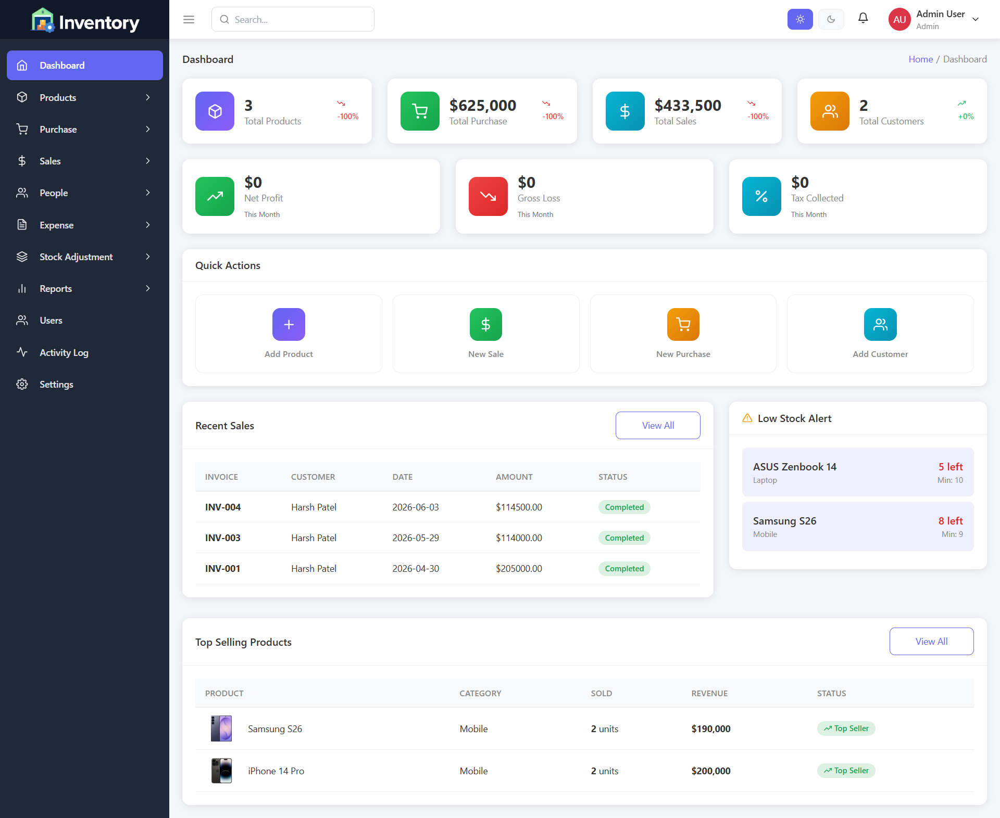

# 📦 Inventory Management System

A full-featured Inventory Management System built with React, TypeScript, and Tailwind CSS. Manage products, sales, purchases, customers, suppliers, expenses, and more — all from a clean, responsive dashboard.

---

## 🖼️ Screenshots

### Dashboard


> Real-time stats for products, sales, purchases, customers, net profit, gross loss, and tax collected.

---

## ✨ Features

- 📊 **Dashboard** — Key stats, recent sales, low stock alerts, top-selling products
- 🛒 **Sales & Sale Returns** — Create and manage sales invoices and returns
- 🏪 **Purchases & Purchase Returns** — Track supplier purchases and returns
- 📦 **Products** — Add, edit, categorize, and manage stock levels
- 👥 **Customers & Suppliers** — Full contact and transaction history
- 🏬 **Stores** — Multi-store support
- 💸 **Expenses** — Log and categorize business expenses
- 📈 **Reports** — Generate and export reports (PDF / CSV / Excel)
- 🔔 **Notifications** — Real-time alerts for low stock and activity
- 🔐 **Auth** — Login, forgot password, reset password with role-based access
- 🌙 **Theme** — Light/Dark mode support
- ⚙️ **Settings** — Currency, tax, and system configuration

---

## 🛠️ Tech Stack

| Technology | Purpose |
|---|---|
| React 18 | UI Framework |
| TypeScript | Type Safety |
| Vite | Build Tool |
| Tailwind CSS | Styling |
| shadcn/ui + Radix UI | UI Components |
| Bootstrap 5 | Layout & Utilities |
| React Router v6 | Routing |
| React Hook Form + Zod | Forms & Validation |
| Axios | API Requests |
| Recharts | Charts |
| jsPDF + xlsx | Export Reports |
| TanStack Query | Server State Management |

---

## 🚀 Getting Started

### Prerequisites

- Node.js >= 18
- npm or bun

### Installation

```sh
# Clone the repository
git clone <YOUR_GIT_URL>

# Navigate to the project directory
cd inventory-managment-system

# Install dependencies
npm install

# Copy environment variables
cp .env.example .env

# Start the development server
npm run dev
```

The app will be available at `http://localhost:5173`

---

## 📁 Project Structure

```
src/
├── components/       # Reusable UI components
├── contexts/         # Auth, Theme, Settings, Notifications context
├── hooks/            # Custom React hooks
├── lib/              # API client, utilities, CSV export
├── pages/            # Route-level page components
│   ├── Dashboard.tsx
│   ├── products/
│   ├── sales/
│   ├── purchases/
│   ├── customers/
│   ├── suppliers/
│   ├── expenses/
│   ├── reports/
│   └── ...
├── services/         # API service functions per module
└── styles/           # Global and admin CSS
```

---

## 🔧 Available Scripts

```sh
npm run dev        # Start development server
npm run build      # Build for production
npm run preview    # Preview production build
npm run lint       # Run ESLint
```

---

## 🌐 Environment Variables

Copy `.env.example` to `.env` and configure:

```env
VITE_API_BASE_URL=http://localhost:8000/api
```

See `BACKEND_SETUP.md` and `INTEGRATION_GUIDE.md` for full backend setup instructions.

---

## 📄 License

This project is private and proprietary.
